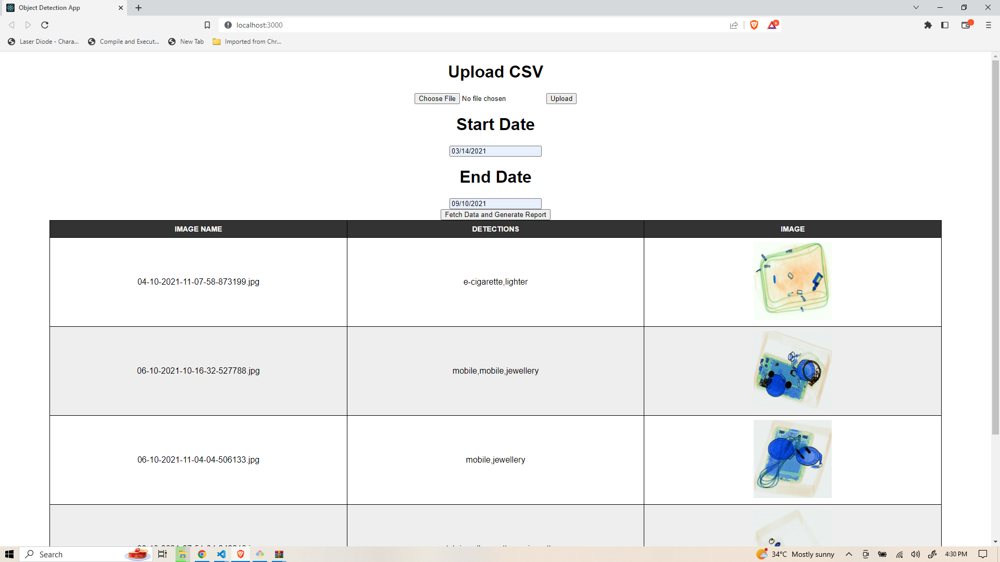
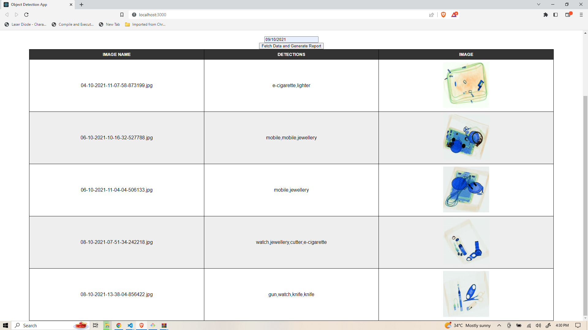

# ObjectDetection App

# Interview Task
ABC is an AI company and they are daily working with object detection algorithms and AI
engineers in that company approached you regarding the creation of one application that will
help them to reduce time in their daily work. So, you have to create that application in the
following manner.

Frameworks to be used:
Backend: Flask or Django
Database: Any SQL or NoSQL DB
Frontend: You will need to use React JS for developing the frontend of the application. You
don’t have to worry about the styling of the frontend (Bonus points if you properly style the
application) but it should be functional and perfectly integrated with the backend.

Task-1:
Create a component in the frontend where the user will upload the provided csv file
(data.csv). After the csv is uploaded, the contents of the csv should be inserted into the
database. You should use the pandas library to read the uploaded csv. You have to store the
following information from the csv into the database
● image_name
● objects_detected
● timestamp (use the timestamp provided in the csv)

Task-2:
On the same page create 2 input date elements from which the user can select the start date
and end date. Now fetch the results between these dates and display them to the user in a
table format. The table should consist of the following information: image_name, detections,
image (use the images provided in the zip file). Sample application shown below.
Also a report should be generated in the backend application which counts the total number
of objects detected between the given date range. Use the python csv module to generate
the csv. The sample output report (report.csv) will be provided to you in the zip file.

## UI Screenshots

## Pre-requisites
- Xampp should be installed on system
- Run phpMyAdmin and start MySql and apache server 
- Create a db in MySql using phpMyAdmin
- Python should be installed on system
- Virtual environment need to be created and activated

## How To Run App
1. Take project in your local machine using below command:
    $ git pull https://github.com/manendranathshukla/objectdetection-backend.git
    $ cd objectdetection-backend
2. Update the newly created db details in `objectdetectionappbackend/settings.py` file
3. Install required libraries from `requirements.txt` file
   $ pip install -r requirements.txt
4. Then apply migrations
   $ python manage.py migrate
5. Now run development server on localhost
   $ python manage.py runserver
    
    
